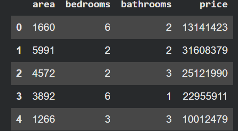
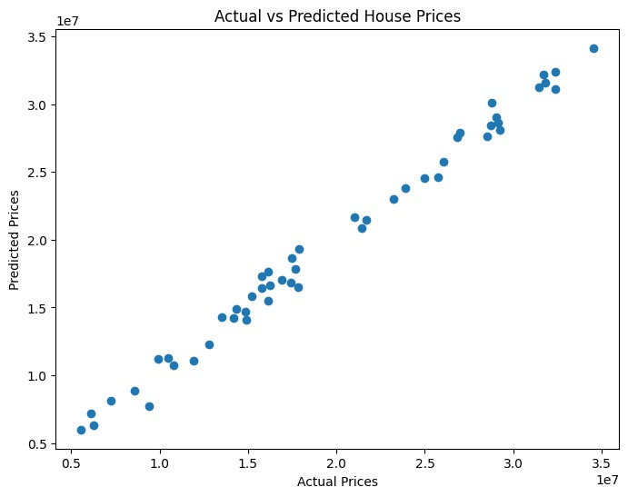

# 🏠 House Price Prediction using Linear Regression

## 📌 Overview

This project implements a **Linear Regression** model to predict house prices based on key property features such as area, number of bedrooms, and number of bathrooms.

The objective is to demonstrate the application of supervised machine learning techniques in solving real-world price prediction problems.

---

## 🎯 Objective

Develop a Linear Regression model capable of estimating house prices using:

* Area (Square Footage)
* Number of Bedrooms
* Number of Bathrooms

---

## 🛠️ Technologies Used

* Python
* Pandas
* NumPy
* Matplotlib
* Scikit-Learn
* Google Colab

---

## 📂 Dataset

The dataset contains housing-related attributes used to train and evaluate the model.

### Dataset Preview

---

## ⚙️ Project Workflow

1. Data Collection
2. Data Preprocessing
3. Feature Selection
4. Train-Test Split
5. Model Training using Linear Regression
6. Prediction
7. Performance Evaluation

---

## 🤖 Machine Learning Model

**Algorithm:** Linear Regression

Linear Regression is a supervised learning algorithm used to model the relationship between independent variables and a target variable.

Features used:

* Area
* Bedrooms
* Bathrooms

Target variable:

* House Price

---

## 📈 Model Performance

### Evaluation Metric

**R² Score:** **0.9904**

The model achieved excellent predictive performance, explaining approximately **99.04%** of the variance in house prices within the dataset.

### Actual vs Predicted House Prices

---

## 🔍 Sample Prediction

The trained model can estimate house prices based on user-provided property details.

Example Input:

* Area: 2500 sq. ft.
* Bedrooms: 3
* Bathrooms: 2

The model generates a predicted house price based on learned relationships from the training data.

---

## 📚 Key Learnings

Through this project, I gained practical experience in:

* Data preprocessing and exploration
* Feature selection
* Training machine learning models
* Model evaluation using R² Score
* Data visualization using Matplotlib
* Implementing Linear Regression with Scikit-Learn

---

## 🚀 Outcome

Successfully developed and evaluated a House Price Prediction model using Linear Regression. This project strengthened my understanding of supervised machine learning and predictive analytics while providing hands-on experience with Python's data science ecosystem.

---

## 👩‍💻 Author

**Divya Sai Sri Javvadi**

Machine Learning Internship Project – Task 1
